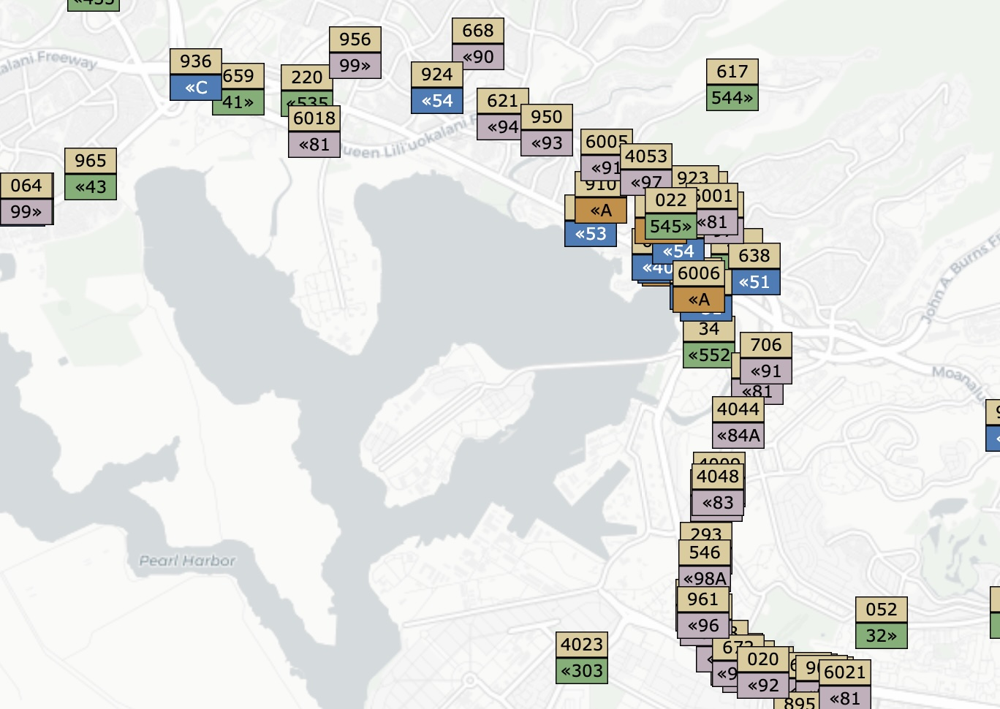
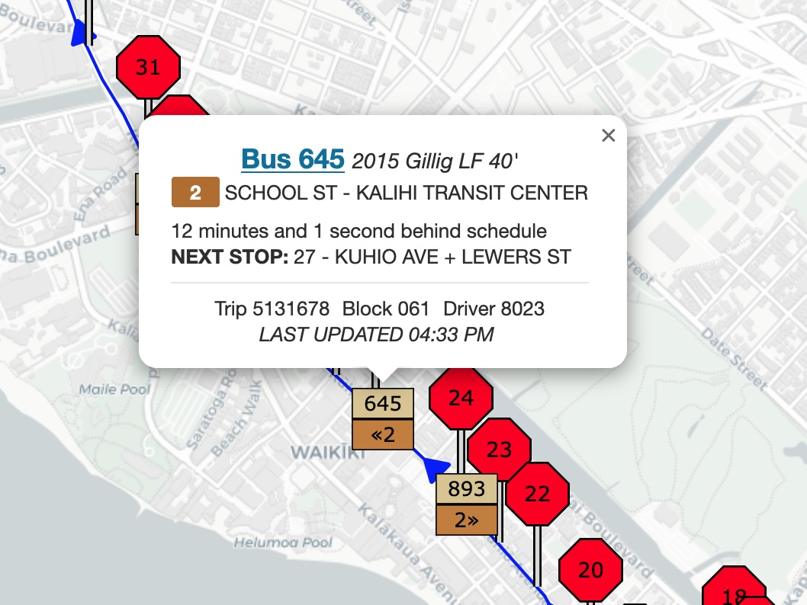

During my first year of college, I dormed which meant I couldn’t get around using a car. Seeing as there was no other alternative, I began using the city bus to go places. If you wanted to see when a bus would arrive at a stop, there’s an app for that called [DaBus2](https://apps.apple.com/us/app/dabus2-the-oahu-bus-app/id1117179614). It works… but I found it to be limiting. For example, I wasn’t able to see the location of every bus for a stop, just one. If I wanted to know when the next A bus was coming, I would need to sift through dozens of arrivals to find it. So, I started digging into how I could make my own bus app, one that I could have on my phone and use to replace the already existing DaBus2 app.

…And here we are six months later, at a point where the site is mostly finished, but with halted development due to college. Now seems like a great time to discuss some struggles I had when writing the website, and why I’m advocating for others to plan a project through before writing actual code. In my case, I was using the right tools and APIs, but I was not using them in the most efficient way.

## The Wheels on TheBus’ API

TheBus has an API where all you need to do is to sign up for an API key, and then you can hook into their endpoints. They split up the API to have two types of responses: `xml` and `json`. If I wanted to get a list of vehicles in `xml`, I would use the `/vehicle?API_key=...` endpoint, otherwise I would need to call `/vehicleJSON?API_key=...` for a response in `json`. Funnily enough, this is the first hurdle: the `vehicleJSON` endpoint doesn’t exist, even though there is [documentation](https://hea.thebus.org/api/documentation/vehicleJSON.pdf) saying that the endpoint does in fact exist… 

Because I was writing the backend in TypeScript, I was going to use the `JSON` endpoints, which I still did for fetching arrivals and route info. To remedy the vehicles' XML response, I just needed to install a package that would convert it to JSON.

Here’s a gripe I had with the API: the lack of distinguishing types for missing data. For example, check out this sample response for the `arrivalsJSON` endpoint:

```json
{
  "stop":"45", "timestamp":"12/20/2022 11:29:59 AM",
  "arrivals": [{
    "id":"1583780421",
    "trip":"4422635",
    "route":"54",
    "headsign":"LOWER PEARL CITY",
    "direction":"Westbound",
    "vehicle":"???",
    "estimated":"0",
    "stopTime":"11:32 AM",
    "date":"12/20/2022",
    "longitude":"0",
    "latitude":"0",
    "shape":"540232",
    "canceled":"0"
  }]
}
```

So, bus `???` is going to `LOWER PEARL CITY` and is arriving at this stop at 11:32 AM. Currently, it’s at… the Atlantic Ocean? Of course, we can recognize this response as the bus simply not being assigned yet, but I find the situation of a bus driver turning the bus into a boat, and driving at light speed to the state capital by 11:32 to be more entertaining. Though, the vehicle and position really should just be null or omitted. Nevertheless, I ended up treating the vehicle as scheduled if the number was `???`.

Speaking of vehicle problems, another strange issue I had was with busses not showing up on the northern part of the island. My app would call the `vehicle` endpoint, which "technically" requires a `num` parameter to select a specific bus, but omitting aforementioned parameter would show you all the vehicles. Regardless of if a number was provided, if a vehicle went above a certain latitude (`21.6`), then suddenly the API would return its latitude as `0`, but the longitude remains normal. 

At first, my approach was to get the path of Kamehameha Highway that travels along the northern side of the island. The path is *mostly* straight, so I could get away with getting a point based on the longitude and simple algebra, but a problem arose when the road went back and forth. There's now multiple points to select from, so which one is right? I had a go with the adherence (how far ahead/behind of schedule is the vehicle) and tried using it to select the right path, but then the vehicle would start going up the road, come back down, then appear to go back up the same road, and make a sudden jump to the road below it with no other roads above or below it. I was at a loss, but then as a last ditch effort, I went back to TheBus' API.

For some reason, this doesn't occur when checking the arrivals for a stop, so I checked to see what busses went through this part of the island (route 60, Kāne‘ohe - Hale‘iwa - Ala Moana Center and express route 88A), and chose 3 stops for busses heading Eastbound and Westbound to cover all my bases. Then, all I did was take the lat/lon positioning for vehicles with GPS and stitch it onto the main vehicle cache object I used for my backend.

Although there were other helpful APIs that DaBus2 used, I found the responses it gave to be more difficult to work with. That is – rather than returning an object of a stop, the API would give responses that put multiple pieces of information into a string.

Ew! Now I have to use RegExes and gently slice off characters:
```json
{
  "stop": "Stop 45 - S BERETANIA ST + PUNCHBOWL ST"
}
```

Easy for programmers to work with: `stop.code`, `stop.name`
```json
{
  "code": "45",
  "name": "S BERETANIA ST + PUNCHBOWL ST"
}
```

So, I proceeded to use this API and scraped the data I needed before coming across a gold mine of information: the GTFS feed. Then, I went back to rewriting all my endpoints to work with the feed.

## Discovery of GTFS

Let’s talk about the identifying features of a bus:
<center>
<br/>
<i>Nova Artic at Kapi‘olani Park on layover, March 2025</i>
</center>
<br/>
Most of the signs on this bus are self explanatory (i.e. route 20 and destination), the only thing that is less commonly known is the "146" on the lower left of the windshield. To understand what this number is, let's dive into that GTFS file that TheBus provides.

What is GTFS? Put simply, GTFS (General Transit Feed Service) is what keeps the drivers on schedule, and the world (mostly) happy. For TheBus’ GTFS, it comes as a zip file containing several files with the .txt extension, but are read as a CSV (think of spreadsheets). Inside, there are crucial pieces of information that detail things like the location and names of every stop, every route name, all of their trips’ names, what time the bus with that trip will arrive, IF that trip will even be in service on that day, and the list goes on. 

In the case of the number "146", this is the block that the bus was assigned. We can use this block to find a list of trips that the bus will run for that day. For example, the bus might go on a trip from Aloha Stadium to Waikiki Beach & Hotels. Then, the driver will go on a short layover before starting a new trip. Most of these blocks contain trips that are on the same route, though it is normal for busses to change routes mid-block. 

I used this block information to display if the bus is on a layover, what the next trip will be, or if it's at the end of the block and returning to a facility. But for other features that relied on the other undocumented API, I decided to replace all those calls by searching the GTFS file. Then, all I would really need from the API is a list of vehicles, and their current trip ID.

## Hot Potato With the Server & Client

This is when the poor planning started to catch up with the project. I knew I wanted to use the feed, but my first question was “who’s going to store the GTFS?”. The ideal answer would be to host it serverside, which is what I went with after I tried having the user download and store it locally. My main concern with hosting the file serverside was that Vercel (the platform I was planning to deploy the application on) doesn’t have a filesystem, so I didn’t see holding GTFS data on Vercel to be viable at first. 

The second question was “what would I do if the file would need to be refetched?”. Each GTFS file only covers a 2 month range of dates before a new file gets published. So, my idea was to show some sort of prompt to the user that they’d need to redownload the feed.

The code that I wrote for this most certainly worked… The user would go to a page, click download, wait and then would be able to use the app. Internally, it would download the GTFS file, which is about 10 MB (sounds fair), is 90 MB uncompressed (ok…), and when fed to Dexie.JS (used to store and fetch from IndexedDB), would take up **300 MB** (a lot!). The time it took to run on my laptop was reasonable, but when testing how long it took to do it on my phone, it took over 9 minutes. I promptly scrapped it and revisited the idea of having Vercel hold onto it. My new approach to host the GTFS was “if Vercel won’t store files, what about storing it in memory?”. This is the current approach that the site uses now, and I’d say it’s a good compromise.

When you host with Vercel, it will kill any sites that it is hosting if there hasn’t been any activity with it. This also involves resetting the memory, which conflicts with my approach of storing it for long-term usage. The process that happens when any API endpoint involving GTFS is called is it will check to see if the object used for caching is empty. If not, we run a `HEAD` request to see when the file was last modified on TheBus.org’s servers. If that’s not newer than when we first checked it, we check if the cached information is outdated. Every feed contains a file stating the start and end dates for when it is intended to be used, so we check if it’s in range. If not, we download the file, and use a CSV parser to convert and store it inside the object we use for caching.

This start process isn’t intended to be called a lot, but with Vercel, this is the case because no one besides me knows and uses the app. It takes about a minute for the initial process to complete, which is better than waiting 9 minutes on your phone. Plus, the user won’t need to know or worry about updating the feed on their end. 

## Maps

Now, let’s talk about maps. I settled on [Leaflet](https://leafletjs.com/) because I used it with another website, and because it’s practically the only map library I know of with a React wrapper. I’ll gloss over the smaller issues like basemap copyright and designing an aesthetically pleasing UI, and skip right to the more problematic issues with UI.

<center>

</center><br/>

Every bus on this map is what Leaflet calls a marker. You can click on each marker to see some more details about the bus, like the headsign and adherence. It’ll also show you the route path and stops based on the trip ID.

<center>

</center><br/>

However, if we wait a couple seconds… The popup closes, yet the route and stops remain! This was an issue with React, where every time I’d refetch the list of vehicles, the vehicles that would get passed to my map component would technically be different from the ones before, even if I used the key property. This led to some vehicle popups being closed, and stumped me at first.

So, I addressed this by changing how the vehicle object worked. In the map component, I had a useRef object which got updated or created vehicles on the ref that were found in the props, or deleted if we haven’t seen the same vehicle on the props within 2 minutes. This meant that the same marker element should have just been modified, rather than wiped and recreated.

I’m sure there were other struggles that I faced, but these were the most problematic ones that I had to deal with. I feel that most of these issues could have been avoided if I had put forethought and testing into my solutions, rather than coding, “oh it doesn’t work”, get it fixed, find it doesn’t work as well as I thought it would, then start over from scratch.

As for my future plans with the app, I'm hoping to expand it so mobile devices have a dedicated app rather than the website. I saw another app use [React Native](https://reactnative.dev/) to accomplish this, so I will most likely learn this framework, then implement it. Some other plans I have are to calculate the bus adherence using the position and to design more desktop-friendly UIs.