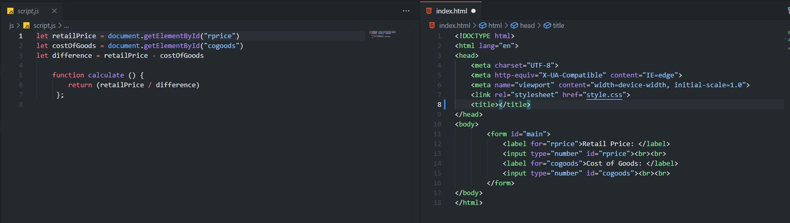

For those that have programmed before, you may be familiar with the Q&A site StackOverflow. It's a place where programmers of different backgrounds and expertise levels ask questions and write answers for each other, some take more than what they give. Yet – there is a set of "unwritten" guidelines, or what a vast majority of the internet tend to ignore on these Q&A sites: the steps required to write a good question, leading to an extensive scrutiny of every new question that gets posted.

I'll walk through a few examples covering good questions & answers, and the inverse. The guidelines that I will compare them to are snippily written in *"[How To Ask Questions The Smart Way](http://www.catb.org/esr/faqs/smart-questions.html)"*, by Eric Raymond.

Let's start off with a good question. This is the most, if not, a highly voted question on StackOverflow. The question asks the following:

## *Why is processing a sorted array faster than processing an unsorted array?* <a href="#c1" id="r1">1</a>

Attached with the tags of `java`, `c++`, `performance`, `cpu-architecture`, and `branch-prediction`.

The author of this post has a simple for loop that calculates the sum of all the numbers in an array that are `>= 128`. They wrote some code that times this summation algorithm itself in C++, but also sorts the array before actually timing and running the main algorithm. They note how sorting the array beforehand will speed up the algorithm (to 1.93s) when compared to leaving the order randomized (takes 11.54s). 

They’re wondering if this behavior was related to C++ or the compiler, so they went ahead and tried the exact same thing in Java, and got similar, but less extreme results. Then, they offer their thoughts on what could be happening and ask why their code runs faster on a sorted array if the order doesn’t matter.

This is a good question. For starters, the author offers sample code in two languages that any reader can copy, compile, and run for themselves. However, it would be even better if the author specified their operating system, motherboard & CPU type, g++ / Java compilation flags, as this could be a known CPU problem. Additionally, this avoids any groveling language, asks an open-ended question, and the answer isn’t likely to be found in the manual. The question was also updated with similar questions for more modern C++ compilers. 

Because other people likely had the same question or problem as the author, they upvoted the post so it would be seen by others, and more likely to receive an answer. Now, let’s take a look at the highest voted answer (at the time of writing).

### “You are a victim of branch prediction fail.” <a href="#c2" id="r2">2</a>

The first sentence of this answer succinctly describes what’s happening to the author. However, assume we don’t know what branch prediction is for a second. The author for this answer then goes in-depth to explain what a branch prediction is, using an analogy to trains and track switching, and ties it to how to predict the condition of the if statement based on previous conditions. 

So, if the condition was constantly all `false`s before, the branch predictor would assume `false` again, because all the numbers that came before it were less than 128. Whereas with the random order, there isn't a clear pattern to pick out, so the branch predictor doesn't speed up the code execution. They also go forward to present a solution that doesn’t require the usage of sorting by converting the `if` statement to bitwise operators that accomplish the same task: calculating the sum of all numbers in an array that are `>= 128`. They also time their solution, comparing it to the author’s code, both in C++ and Java. The answer goes into more detail, so if you want to see the full question and answer for yourself, I recommend checking it out. 

This well-documented question received a lot of explanatory answers that pointed to the same cause. On the other hand, let’s look at a question that isn’t specific in what it wants, or in other words, isn’t a smart question. Contrary to what my [assignment](https://courses.ics.hawaii.edu/ics314f25/morea/open-source-software/experience-smart-questions.html) said, “bad questions” were fairly abundant on the site, as all I had to do was search for questions with negative votes, and sift through them. After a few minutes of intentionally misspelling question words, I came across this:

## *Hwo do I display the output of a javascript function through HTML* <a href="#c3" id="r3">3</a>

Accompanied by the tags `javascript` and `html`.

To paraphrase the question, the author *presumably* wants to calculate the price of something by using two HTML input elements, and display it to the user. Then, they put a link to an **image** of their code, which displays the HTML of their site, and the contents of their JS file. 

  

 

While a picture may be worth a thousand words, it doesn’t make solving the problem that they are having any easier. When comparing this to what we should look for in smart questions, there’s several things I found wrong. For starters, the typo in their title (change Hwo to How), minor grammatical issues (Im should be I’m in "*Im trying to ...*"), and the obvious photo of their code. A more subtle issue I noticed was the lack of research that the author did before sending their question out into the wild, as indicated by the following just under the question name:

<blockquote class="border bg-light p-3 rounded-3">
  <b>This question already has answers here:</b> 

  <u>How do I change the text of an element using JavaScript?</u> (18 answers) 

  Closed 4 years ago. 
</blockquote>

Their question doesn’t exactly have an “actual result” either, it’s just that they don’t know how to manipulate a DOM element, and that they want to display the price somewhere. In short, I consider this a “RTFM”-based question.

 
<i>Image credit: <a href="https://xkcd.com/293">xkcd</a> | Licensed under <a href="https://creativecommons.org/licenses/by-nc/2.5/">CC BY-NC 2.5</a>.</i>

 

I will give them props for only showing the problematic parts of their code, as when I was researching other questions, I came across one that dumped their entire file into a single snippet. Additionally, their code seemed well formatted, aside from the extra indentation on the `calculate` function.

Aside from that, let’s take a look at the answer<a href="#c4" id="r4">4</a> they received:

### Some Tinkering Required

This answer essentially tells the author how to use the `innerHTML` property on an element. They’ve also included a code snippet (not the author’s code) that demonstrates how it can be used. While it’s less informative than the branch prediction answer, it still gets the job done, and educates the author rather than spoonfeeding them their project to work and do what they wanted. 

We haven't seen a bad answer yet, so let’s take a look at that question linked in the duplicate box. This one pretty much asks the same question of how to change the text of an element, and has more answers than what we were just looking at; hence, a duplicate.

### The jQuery Alternative <a href="#c5" id="r5">5</a>

In this answer, we have a runnable code snippet, followed by this comment:

"user `text()` to change span text."

No other explanation is provided. So, what's actually happening in the snippet?

Inside the snippet, we download the jQuery library, and use the `$(...).text()` function to change the text of an element. The answer doesn't explicitly mention that we will be adding jQuery as a dependency, and assumes that the author of the post is using, or plans to use it. Neither question mentions jQuery, and they also don't mention that it's off-limits. So, the ambiguity of the question leads to a wider range of answers which can be for better or the worse, depending on what the author wants to do that got omitted from the question. In this context, jQuery is a large library in filesize, and is being used to replace a trivial task: changing the text on an element. If you ask any well-seasoned programmer to choose between the two, they'd pick the `innerText` solution every time. jQuery has its uses, but this application of it is quite overkill.

## "But why ask a good question, if the bad ones get answered anyways?"

Have you ever heard of the term "[`GIGO`](https://en.wikipedia.org/wiki/Garbage_in,_garbage_out)"?

I'll save you another essay, but it was derived from the terms `LIFO` (**L**ast **I**n, **F**irst **O**ut) for stacks, and `FIFO` (**F**irst **I**n, **F**irst **O**ut) for heaps. It's a humorous term that says if you feed a machine garbage input, you'll receive garbage output that'll have no value to you. Although the people of StackOverflow aren't machines (yet), we can easily apply the same logic here; where the amount of details you give equates to how many people can and will answer your question. So, if you ask a bad question, chances are you won't get the answer that you want, or necessarily solves your problem.

Inversely, if you include more information, meaning you have put more research and thought into your question, the more likely you will receive an answer that is more informative, and of higher quality. The effort you put in is directly proportional to the effort you receive. Anyways, it’s always better to be specific in what you’ve tried and what’s happening. If you want to save yourself from a barrage of downvotes and snarky comments, **put in the effort into making a good question!**

<footer>
<i>All references are on StackOverflow, licensed under <a href="https://creativecommons.org/licenses/by-sa/4.0/">CC BY-SA 4.0</a>.</i> 

<a href="#r1" id="c1">1^</a> - <a href="https://stackoverflow.com/q/11227809">Why is processing a sorted array faster than processing an unsorted array?</a> 
<a href="#r2" id="c2">2^</a> - <a href="https://stackoverflow.com/a/11227902">Branch Prediction Answer</a> 

<a href="#r3" id="c3">3^</a> - <a href="https://stackoverflow.com/q/67186041">Hwo do I display the output of a javascript function through HTML</a> 

<a href="#r4" id="c4">4^</a> - <a href="https://stackoverflow.com/a/67186244">.innerText Demonstration Answer</a> 

<a href="#r5" id="c5">5^</a> - <a href="https://stackoverflow.com/a/63306749">jQuery Snippet Answer</a> 

</footer>