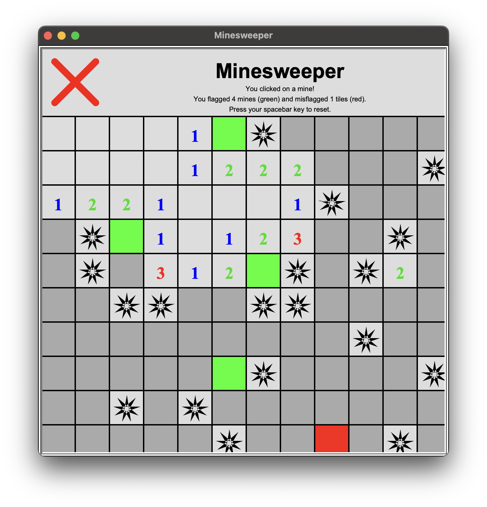

## Experiences for Today

I think it's safe to say that my strong spot in terms of software engineering would be web development. With my first full-fledged solo project being [BrokeDaBus](https://brokedabus.vercel.app), an alternative to the already existing [DaBus2](https://apps.apple.com/us/app/dabus2-the-oahu-bus-app/id1117179614) app for bus arrival tracking. For the creation of this site and a few others, I used tools I knew: TypeScript, React, Next.JS, and Tailwind CSS. I have even developed one site without React, which was tedious to say the least. Although I am strong in web development, other languages outside of that scene I know are Python and Java, where I have used Python for programming [Minesweeper using turtle](https://github.com/kylersm/python-turtle-games), and Java for implementing a variety of data structures. 

I have even made websites for my workplace. Although these have been made public, there exists little to no public documentation on how it works. My reason for making the sites was to have a tool that automated and eliminated the simple (yet repetitive) tasks where my coworkers and myself included were fatigued with. The programs didn’t need to be fleshed out into an application (plus would require my successor to know how to maintain), so I went with a website that could be accessed from anywhere. Additionally, I also tried as much as possible to have human interaction (having everything be controlled by the user), rather than to work like magic in case something bad arises when I have already left.

## Skills for Tomorrow

If I were forced to choose between frontend or backend development, I’d find myself more content with backend, as I’ve spent more time typing code rather than designing user interfaces. Even though I’m not experienced with UI, I think I’d be willing to put in some effort into learning the basic laws of UI. Outside of the web development circle, I have had light experience with programming games with Unity and C#, and developing web scraping tools.

In terms of other skills I want to learn, it would have to be programming more with C and C++, and experiencing crash courses in other languages and frameworks. I will mention that I have worked with C and C++ for ICS 212, but I’d like to have my knowledge of C++ surpass that of Java. Even though web development is my highest interest, I think trying out other areas of software development might further expand my interests. 