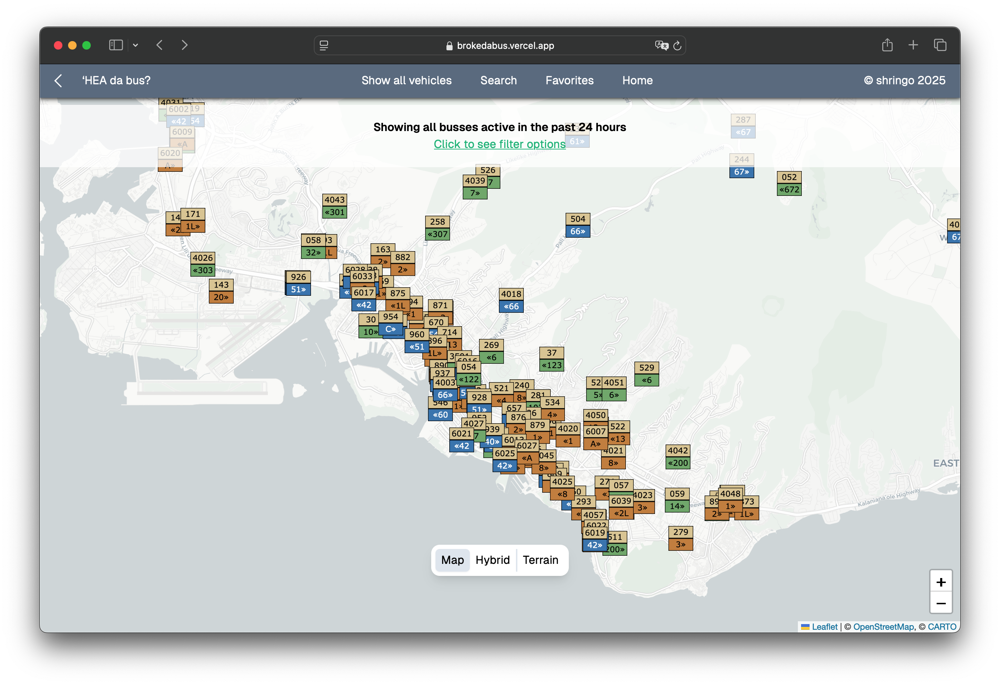

BrokeDaBus was an app I started coding around the time I got my first job. It's a hobby website that's meant to do everything that the [DaBus2](https://apps.apple.com/us/app/dabus2-the-oahu-bus-app/id1117179614) app does, but also adds additional features, like route information and seeing all vehicles. I gained inspiration to write this app after underestimating how quickly the busses would come, thus missing them. Other features I worked on were maps that showed all the vehicles on a route, next stop information, and re-implementing features that I found didn't work on DaBus2.

I used tools that my peers used for our [website entry](./hacc.html) for the Hawaii Annual Code Challenge, and used that to build the website. I used the [T3](https://create.t3.gg/) stack, which consists of [Next.JS](https://nextjs.org/) for my React framework, [Tailwind CSS](https://tailwindcss.com/) for styling, [tRPC](https://trpc.io/) router for API services and also [Leaflet](https://leafletjs.com/) for interactive maps.

The entire site is coded in TypeScript, and took around 6 months of work in-between my classes to finish the bulk of the site. I've also added some hidden features catered towards bus enthusiasts. If you want to read about some of the uphill battles that I faced when writing the app, here is <a href="../essays/development-of-brokedabus.html">my essay about it</a>.

Check it out!

  
Source: <a href="https://github.com/kylersm/brokedabus">kylersm/brokedabus</a>

  
Live Website: <a href="https://brokedabus.vercel.app">BrokeDaBus</a>

