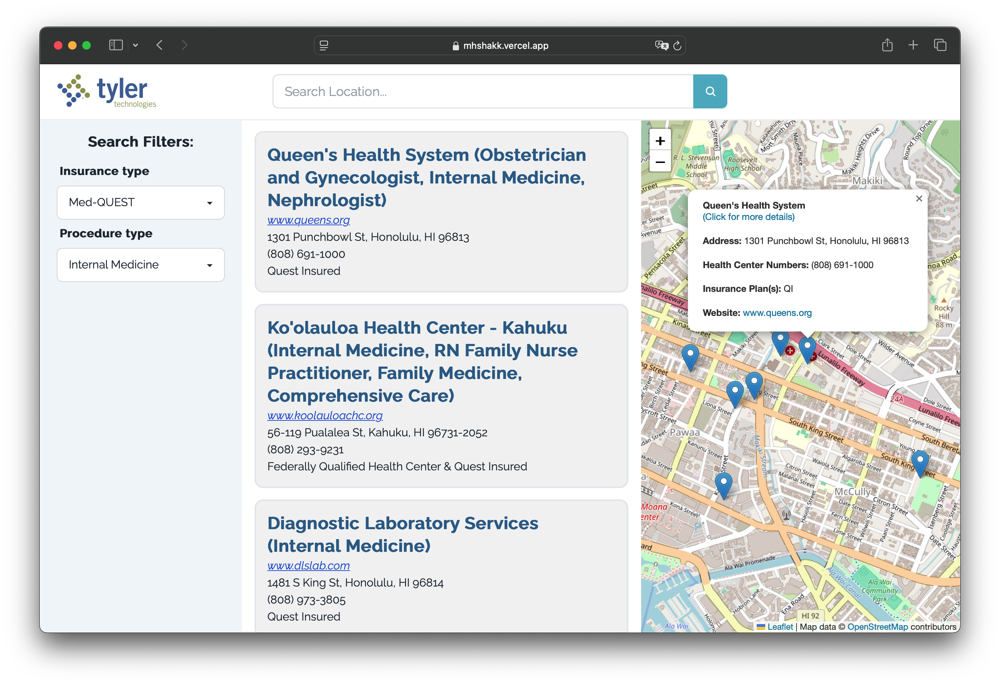

The Hawaii Annual Code Challenge involves selecting a challenge presented by various companies, programming a solution to the challenge, and presenting it in front of an audience and judges. There are three categories for ranking: high / middle school, college, and professionals. Out of the challenges presented to us at the time, we thought that the affordable healthcare challenge seemed most feasible to code for our level. We interpreted the challenge as finding healthcare clinics that do specific procedures on the under-insured or uninsured.

Our timeline for the project was about 1½ months long. We had to put a lot of forethought into what the challenge was asking before we started programming anything. So, we had to research the American Healthcare system, looked at medical codes for procedures, insurance types in Hawaii (like medQUEST), and smaller things to conform with copyright, like using Leaflet over Google maps and scraping clinic data. For this project, I contributed fairly equally to both the frontend and backend, adding search functionality, a mobile view and dark mode. 

A few things I learned from this project was how to make my code readable to others by using comments and clearer variable names. This was also my first major project that was also with a team, so communication and teamwork played a big part as well. I was also to apply my presentation-making skills by inserting mockup images of our site on different device bezels.

Check it out!

  
Source: <a href="https://github.com/HACC2023/MHS-HAKK">HACC2023/MHS-HAKK</a>

  
Live Website: <a href="https://mhshakk.vercel.app">HelpCare</a>

  
HACC News Release: <a href="https://hacc.hawaii.gov/news-releases/2023-hawaii-annual-code-challenge-winners-are/">2023 Hawai‘i Annual Code Challenge Winners are…</a>

