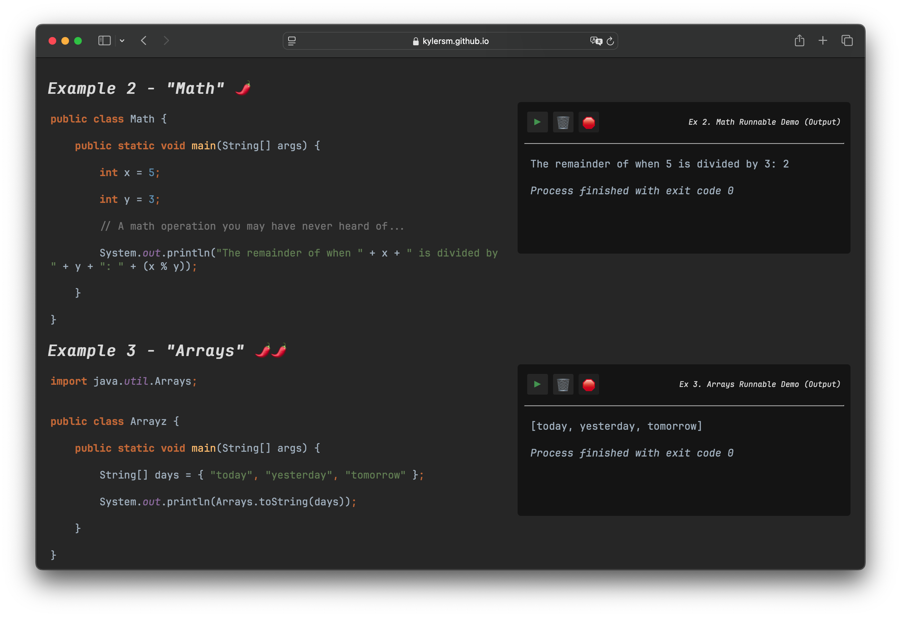
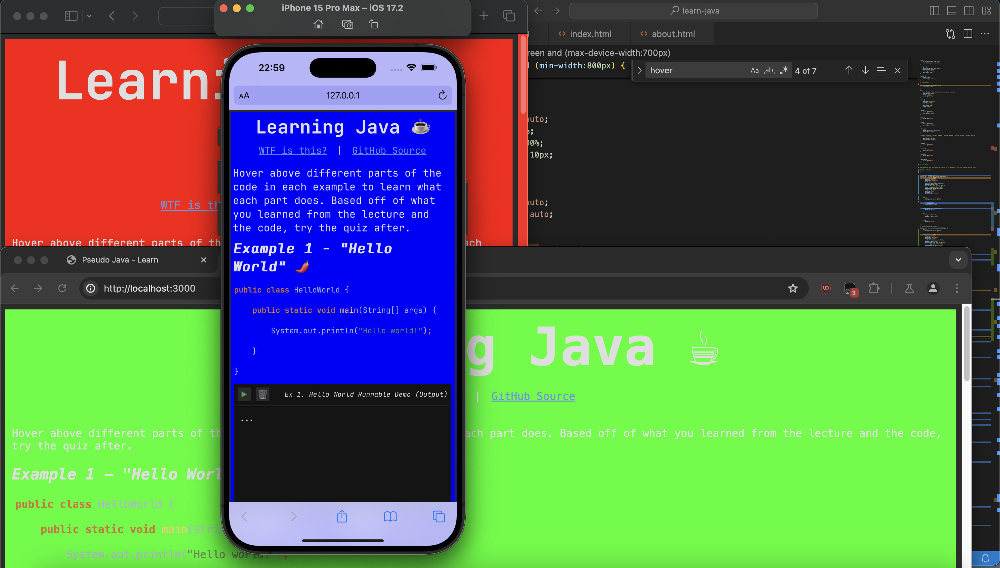

<i>TL;DR: I wrote a site without relying on third-party libraries.</i>

For my ENG 100 class, my instructor wanted everyone to create a "self-introduction" presentation that talked about anything we wanted, followed up by a short activity. Instantly, I was dead set making it about programming, but not sure how to go about presenting it to my peers in a way that would be easy to understand for people who have never written a line of code before. After all, programming is like learning a world language where nuance, practice, and knowledge are required to properly control it.

At first, I was thinking of doing a standard presentation where I would blabber on about something for ten minutes then make them do an activity. Then, I realized how cliche a powerpoint would have been, so I decided to condense the basics of Java into 7 files that I would explain. To demonstrate the potential of programming, I booted up Minecraft mid-lecture with a mod I wrote to draw interest.

Now, the most tedious part was the activity. The activity is a site, containing a few code snippets that show tooltips when you hover on a line, along with runnable examples. At the end, there is a quiz based on the lecture and snippet contents with feedback and scoring. The site itself does not sound that complex, but I (for some reason) was keen on doing everything from scratch. The whole site was built with plain HTML, CSS and Javascript; with the only third-party dependency being a monospaced font.

To further put things into perspective, I had to consider what devices my peers would be using – if they didn't have their laptop, how could I make the tooltips work on a phone? Even the browser mattered if it was the same device – does this look the same, or even work on that browser? I also had to write code that highlighted the code snippets to look as if it was in IntelliJ IDE. However, making the runnable demos was quite easy. I chose the examples, and I was not having the user write their own code snippets, so I just rewrote each example in JavaScript and redirected `console.log` to append the arguments to an HTML element.

  <i style="margin: auto;">A screenshot of my desktop while testing UI responsiveness.</i>

 

Despite the simplicity of the site, it made me appreciate the libraries that others have developed to perform things like syntax highlighting in the first place. The activity went well, though I recall one person having trouble with the site showing a blank screen. Safari on macOS ended up being the most problematic out of the browsers I was testing with.

If you want to test your Java skills, check out the site!

  
Source: <a href="https://github.com/kylersm/learn-java">kylersm/learn-java</a>

  
Live Website: <a href="https://kylersm.github.io/learn-java">Learning Java</a>

